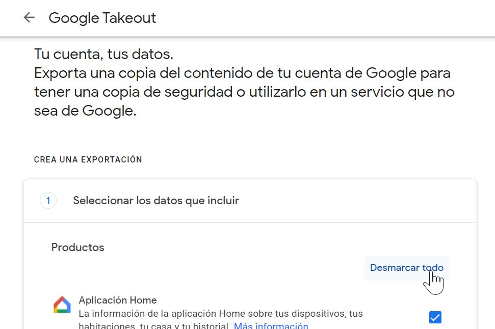
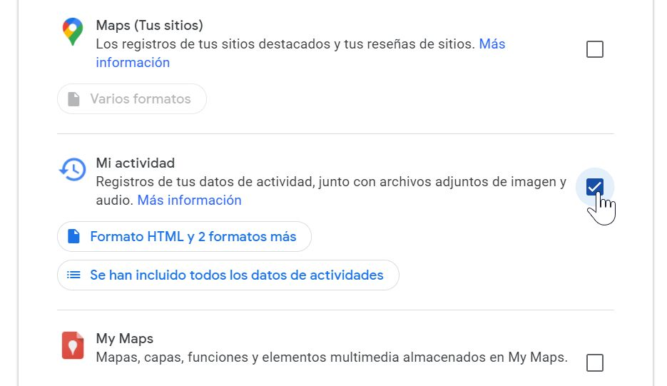
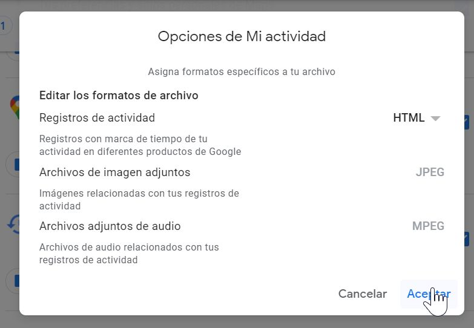
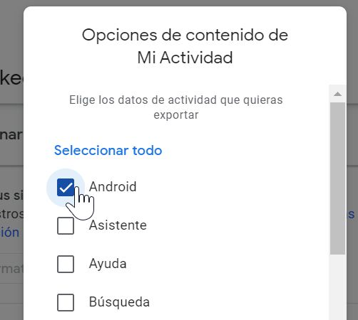
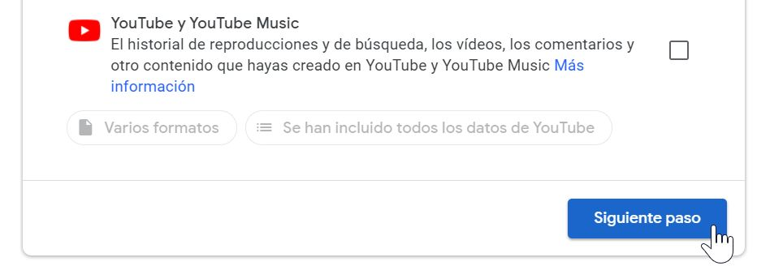
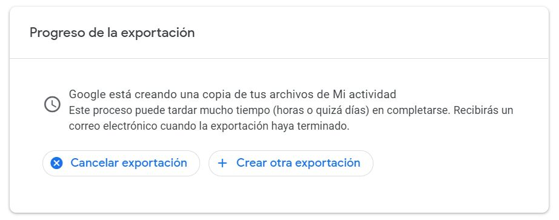
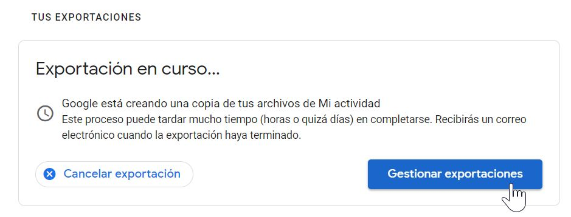
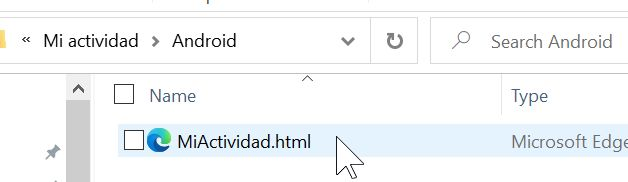

<a href="https://delaiglesialab.github.io/DigitalRhythmsProject/2_android.html">Read in English</a> 🇺🇸 

# Paso 1 de 2: Obteniendo los datos

Este paso es bastante sencillo y debiera tomar poco tiempo, pero para que sea incluso más fácil, hemos documentado cada uno de los clics requeridos. Así que no se alarme, esto no será tan lento o complejo como la longitud de esta página parece sugerirlo.

### Cómo obtener los datos de actividad de su teléfono Android:

El primer paso es hacer clic en el enlace aquí abajo para ir al servicio  Takeout de Google.

### <a href="https://takeout.google.com" target="_blank"> takeout.google.com </a>

**En caso de que tengas tu cuenta de Google configurada en inglés podés seguir este tutorial en inglés [aquí](https://delaiglesialab.github.io/DigitalRhythmsProject/2_android).**

Asegúrese de iniciar sesión con la misma cuenta que utiliza como principal en su teléfono Android.

A continuación, haga clic en "deseleccionar todo" como se muestra a continuación, ya que solo queremos exportar los datos de actividad de las aplicaciones.

Luego desplácese hacia abajo para encontrar el cartel "Mi actividad". Por lo general, se encuentra entre "Mapas" y "Mis mapas".

Marque la casilla de verificación a la derecha y haga clic en el botón "Formatos múltiples" a la izquierda.

En la ventana emergente, asegúrese de que los *Registros de actividad* estén configurados en el formato HTML como la imagen de abajo y **NO** JSON. Haga clic en "Aceptar" para continuar.

Ahora haga clic en el botón que dice "Todos los datos de actividad incluidos", y en la ventana emergente, primero haga clic en "Deseleccionar todo" y luego marque la casilla de verificación para Android como se muestra abajo. Haga clic en "Aceptar" para continuar.

Desplácese hacia abajo y haga clic en "Paso siguiente".

En el segundo paso, seleccione la frecuencia "Exportar una vez". Puede escoger el tipo de archivo de descarga que sepa que puede abrir (la mayoría de las personas se sentirán familiarizadas con el formato '.zip').

El tamaño máximo de archivo predeterminado de 2 GB (.zip) puede ser dejada tal como está; ¡pero no se alarme! La descarga no será muy grande (<100 MB) dependiendo de cada usuario.

Haga clic en "Crear exportación", y estará (casi) listo.

Una vez que haga clic en "Crear exportación", verá un nuevo banner como este, indicándole que la creación de su archivo está en marcha.

Este proceso no debiera tomar más de 5 minutos. **Sin embargo, puede recibir una notificación en su teléfono y/o un correo electrónico de Google, pidiéndole que confirme que fue usted quien solicitó esta exportación. Es posible que no reciba un enlace de descarga hasta que abra ese correo electrónico o notificación y haga clic en "Sí".**

Ahora puede sentarse a esperar el mensaje de Google, que puede tomar más o menos tiempo dependiendo de la cola de trabajo en los servidores de Takeout. Siéntase libre de pausar estas instrucciones aquí y continuar cuando sea conveniente para usted. Salga a caminar, coma algo, haga un poco de yoga, o llame a un amigo/a - pero no se quede simplemente mirando la pantalla hasta que su archivo esté disponible :)

Alternativamente, si vuelve a cargar la página, encontrará un nuevo cartel en la parte superior con un botón para "Administrar exportaciones", tal como se muestra a continuación.

Al hacer clic en él, se abrirá una nueva página con su historial de exportaciones, y dirá que su exportación está en curso. Si tiene suerte, verá la exportación con el enlace de descarga disponible de inmediato (provisto que hay confirmado ya desde su correo electrónico o teléfono). Si todavía no está disponible la descarga, simplemente espere y vuelva a cargar en un momento y debería obtener la opción de descarga.

La descarga puede requerir que vuelva a iniciar sesión ingresando su contraseña. Una vez que lo haya descargado, abra el archivo comprimido usando su administrador de archivos favorito. (su sistema operativo puede que abra estos archivos sin problemas).

Una vez abierto el archivo, ingrese en la carpeta ***"Takeout"***, luego a la carpeta ***"My Activity/Mi actividad"***, y finalmente a la carpeta ***"Android"*** para encontrar el archivo ***"Mi actividad.html"***.

Copie y guarde este archivo en una ubicación conveniente para cargarlo en el siguiente paso.

**¡Felicitaciones! Ahora ya ha conseguido su archivo de datos de uso de aplicaciones en Android. Eso es todo en este primer paso.**

Le recomendamos que abra este archivo en su computadora y lo revise, si así lo quiere. El archivo mostrará una lista aparentemente interminable de nombres de aplicaciones y las horas en las que fueron utilizadas, **pero ningún tipo de información personal.**

Una vez que se sienta cómodo con compartir este archivo con nosotros, haga clic en el botón más abajo.

Sin embargo, si todavía tiene dudas, le ofrecemos la opción de generar un nuevo archivo más sencillo del cual se hayan removido todos los nombres de las aplicaciones antes de que pueda compartirlo con nosotros. Haga clic en el ícono de abajo que lo llevará a un tutorial en ***Google Colab*** con las instrucciones necesarias - pero antes de hacerlo, considere una vez más compartir el archivo original con nosotros, que nos permitirá realizar análisis incluso más interesantes. Recuerde que sus datos serán anonimizados y conservados en un servidor seguro. Si aún así prefiere remover toda la información de los nombres de sus aplicaciones, abra el link de abajo y siga las instrucciones antes de continuar.

Una vez que haya obtenido el archivo (de extensión CSV) a través de este proceso, haga clic en el botón más abajo.

